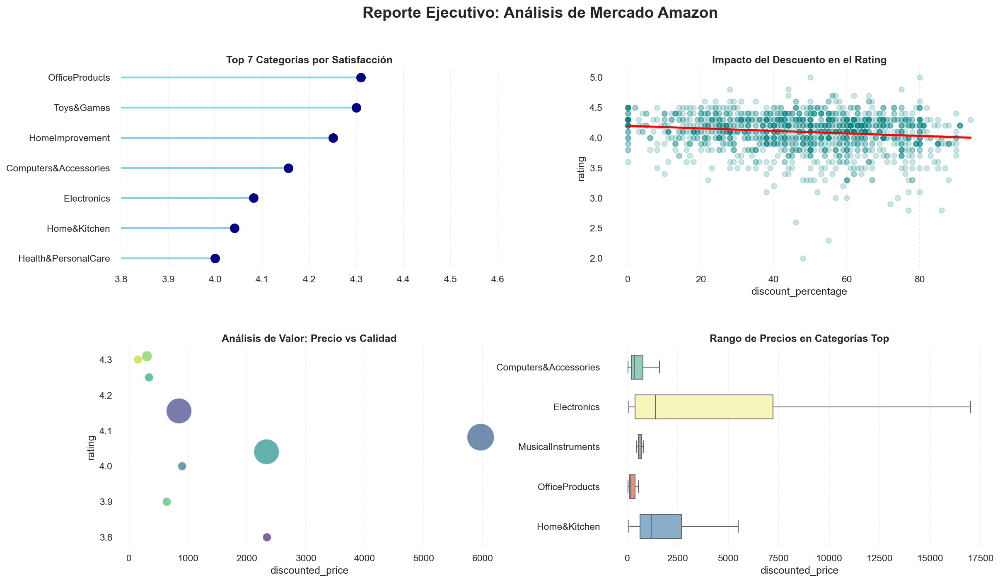

# 📊 Análisis de Estrategia de Precios y Comportamiento del Consumidor — Amazon India

## 🎯 Objetivo

¿Los descuentos agresivos afectan negativamente la percepción de calidad del cliente?

Este proyecto analiza más de 1,400 productos del marketplace de Amazon India para determinar si existe una relación entre el porcentaje de descuento y la satisfacción del cliente, e identificar los rangos de precio con mayor competitividad.

---

## 📁 Estructura del repositorio

```
amazon-eda/
│
├── amazon_eda.ipynb        # Notebook principal con ETL + EDA
├── amazon.csv              # Dataset original (fuente: Kaggle)
├── cleanedAmazon.csv       # Dataset limpio generado tras el ETL
├── dashboard_amazon.png    # Dashboard ejecutivo con los 4 paneles
└── README.md
```

---

## 🛠️ Stack utilizado

- **Python 3**
- **Pandas** — limpieza y transformación de datos (ETL)
- **Matplotlib + Seaborn** — visualización y dashboard

---

## ⚙️ Flujo de trabajo

### Fase 1 — ETL
- Eliminación de símbolos monetarios (₹) y normalización de tipos de datos
- Detección y manejo de valores nulos y duplicados
- Corrección de errores lógicos (productos con precio con descuento mayor al precio original)
- Detección de outliers por método IQR
- Segmentación de categorías anidadas para obtener la categoría principal

### Fase 2 — EDA
- Análisis de satisfacción promedio por categoría
- Evaluación de correlación entre descuento y rating
- Matriz de valor: precio promedio vs. calidad por categoría
- Análisis de variabilidad de precios en el Top 5 de categorías

---

## 💡 Hallazgos principales

**1. El descuento no afecta el rating**
La correlación entre el porcentaje de descuento y la valoración del cliente es de **-0.15**, prácticamente inexistente. El descuento solo explica el **2.4%** de la variación en el rating.

**2. El mercado se juega por debajo de ₹2,000**
El **75% de los productos** tiene un precio menor a ₹2,000. Esa es la zona de mayor densidad competitiva del marketplace.

**3. Consistencia vs. volumen**
- **OfficeProducts** lidera en satisfacción con un rating promedio de **4.31**
- **Electronics** domina en volumen pero tiene la mayor volatilidad de precios (desviación estándar de ±₹10,000)

---

## 📊 Dashboard



---

## 📂 Dataset

- **Fuente:** [Amazon Sales Dataset — Kaggle](https://www.kaggle.com/datasets/karkavelrajaj/amazon-sales-dataset)
- **Registros:** 1,465 productos
- **Variables:** 16 columnas (precio, descuento, rating, categoría, reseñas)

---

## ▶️ Cómo ejecutar

1. Clona el repositorio
```bash
git clone https://github.com/francosalinashuerta/amazon-eda.git
cd amazon-eda
```

2. Instala las dependencias
```bash
pip install pandas matplotlib seaborn
```

3. Abre el notebook
```bash
jupyter notebook amazon_eda.ipynb
```

---

*Proyecto de análisis exploratorio de datos — portafolio personal*
